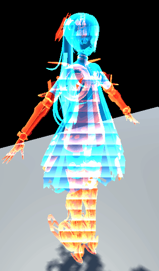

# UnityShaderGraph

Done in Unity Shader graph

https://github.com/xrhrepus/unityShaderLearning

# Content
- [Waterfall](#waterfall-splash)
- [Hologram](#hologram)

## Waterfall Splash

Classic toon shading style water;

Customizable water wave, color, refraction and foam;

## Hologram

Hologram effect with scanlines + Fresnel edge glowing effect;

Customizable color, fliker frequence, edge glowing, scanline frequence and direction;

